<p align="center">
  
</p>

<h1 align="center">AI for the Win</h1>

<p align="center">
  <strong>Build AI-Powered Security Tools | From Zero to Production</strong>
</p>

<p align="center">
  <a href="https://github.com/depalmar/ai_for_the_win/actions/workflows/ci.yml"></a>
  <a href="https://github.com/depalmar/ai_for_the_win/stargazers"></a>
  <a href="https://github.com/depalmar/ai_for_the_win/graphs/contributors"></a>
  <a href="https://github.com/depalmar/ai_for_the_win/commits/main"></a>
</p>

<p align="center">
  <a href="https://www.python.org/downloads/"></a>
  <a href="https://opensource.org/licenses/MIT"></a>
  <a href="https://colab.research.google.com/github/depalmar/ai_for_the_win/blob/main/notebooks/lab01_phishing_classifier.ipynb"></a>
  <a href="./Dockerfile"></a>
</p>

<p align="center">
  <a href="#-get-started-in-5-minutes">Quick Start</a> •
  <a href="#-learning-paths">Learning Paths</a> •
  <a href="#-what-youll-build">Labs</a> •
  <a href="./docs/">Documentation</a> •
  <a href="https://github.com/depalmar/ai_for_the_win/discussions">Community</a>
</p>

---

A hands-on training program for security practitioners who want to build AI-powered tools for threat detection, incident response, and security automation. **25 labs** (including 5 intro labs), **4 capstone projects**, **15 CTF challenges**. Includes **sample datasets** and **solution walkthroughs**. Designed for **vibe coding** with AI assistants like Cursor, Claude Code, and Copilot.

## 📑 Table of Contents

- [🚀 Get Started in 5 Minutes](#-get-started-in-5-minutes)
- [🎯 Learning Paths](#-learning-paths)
- [🛠️ What You'll Build](#️-what-youll-build)
- [⚡ Quick Start Options](#-quick-start-options)
- [📁 Repository Structure](#-repository-structure)
- [🏆 Capstone Projects](#-capstone-projects)
- [🔌 Templates & Integrations](#-templates--integrations)
- [🧪 Development](#-development)
- [❓ Getting Help](#-getting-help)
- [🔗 Quick Links](#-quick-links)
- [🤝 Contributing](#-contributing)
- [📜 License](#-license)

---

## 🚀 Get Started in 5 Minutes

### Complete Beginner? Start Here:

```bash
# 1. Clone the repository
git clone https://github.com/depalmar/ai_for_the_win.git
cd ai_for_the_win

# 2. Install Python dependencies
python -m venv venv
source venv/bin/activate  # On Windows: .\venv\Scripts\activate
pip install -r requirements.txt

# 3. Start with Lab 00a (Python basics) - NO API KEY NEEDED!
cd labs/lab00a-python-security-fundamentals
cat README.md  # Read the lab instructions

# Then try Lab 01 (ML classifier) - STILL NO API KEY NEEDED!
cd ../lab01-phishing-classifier
python solution/main.py
```

### Ready for LLM-Powered Labs? (Labs 04+)

```bash
# Configure API key (choose ONE provider)
cp .env.example .env
echo "ANTHROPIC_API_KEY=your-key-here" >> .env  # Get from console.anthropic.com
# OR use OpenAI/Google - see .env.example for all options

# Verify your setup
python scripts/verify_setup.py

# Run your first LLM lab
cd labs/lab04-llm-log-analysis
python solution/main.py
```

> 📖 **New to Python or ML?** Start with Labs 00a-00b-01-02-03 (no API keys required!)
> 📖 **Know ML, want LLMs?** Jump to Lab 04 and get an API key first
> 📖 **Need help?** Read [GETTING_STARTED.md](./GETTING_STARTED.md) for detailed setup
> 📖 **Lost in the docs?** See [DOCUMENTATION_GUIDE.md](./DOCUMENTATION_GUIDE.md) for navigation

---

## 🎯 Learning Paths

```mermaid
flowchart LR
    subgraph INTRO["🎯 INTRO<br/>Labs 00a-00c"]
        I1[Python Basics]
        I2[ML Concepts]
        I3[Prompt Mastery]
    end
    
    subgraph FOUNDATION["🟢 FOUNDATION<br/>Labs 01-03"]
        F1[Text ML]
        F2[Clustering]
        F3[Anomaly Detection]
    end
    
    subgraph LLM["🟡 LLM TOOLS<br/>Labs 04-07"]
        L1[Prompt Engineering]
        L2[RAG Systems]
        L3[Code Generation]
    end
    
    subgraph ADVANCED["🟠 ADVANCED<br/>Labs 05, 08-10"]
        A1[AI Agents]
        A2[Pipelines]
        A3[IR Automation]
    end
    
    subgraph EXPERT["🔴 EXPERT<br/>Labs 11-20"]
        E1[Ransomware Detection]
        E2[Memory Forensics]
        E3[Adversarial ML]
        E4[LLM Red Teaming]
    end
    
    INTRO --> FOUNDATION
    FOUNDATION --> LLM
    LLM --> ADVANCED
    ADVANCED --> EXPERT
```



### Recommended Learning Paths (Choose Yours!)

| Your Background | Start Here | Learning Path |
|-----------------|------------|---------------|
| **Complete beginner** (no Python) | Lab 00a | 00a (Python) → 00b (ML theory) → 01 (ML hands-on) → 02 → 03 → 04 (LLMs) → 00c (advanced prompting) |
| **Know Python**, new to ML | Lab 00b | 00b (ML theory) → 01 → 02 → 03 (ML foundations) → 04 → 06 → 05 (LLM/agents) |
| **Know Python & ML**, new to LLMs | Lab 04 | 04 (basic prompting) → 06 (RAG) → 05 (agents) → 00c (advanced prompting) → 07-10 |
| **Want to build AI agents** | Lab 04 | 04 (prompting) → 05 (ReAct agents) → 06 (RAG) → 10 (copilot) → Capstone |
| **DFIR/SOC analyst** | Lab 01 | 01 → 03 (ML detection) → 04 (log analysis) → 11 (ransomware) → 13 (memory forensics) |
| **Red Team/Offensive** | Lab 03 | 03 (anomaly det) → 12 (purple team) → 14 (C2) → 15 (lateral movement) → 17 (adversarial ML) |
| **Threat Intel analyst** | Lab 04 | 04 (log analysis) → 05 (threat intel agent) → 06 (RAG) → 14 (C2) → 16 (actor profiling) |
| **Security engineer** (build production tools) | Lab 01 | 01 → 03 → 04 → 08 (vuln scanner) → 09 (pipeline) → 10 (IR copilot) → Capstone |

**💡 Pro Tip**: Labs 01-03 require NO API keys - perfect for learning ML foundations cost-free! Get comfortable with ML before moving to LLM-powered labs (04+).

---

## 🛠️ What You'll Build

### Labs Overview

| Lab | Project | What You'll Learn |
|-----|---------|-------------------|
| **00a** | **Python for Security** | Variables, files, APIs, regex, security-focused Python basics |
| **00b** | **ML Concepts Primer** | Supervised/unsupervised learning, features, training, evaluation metrics |
| **00c** | **Intro to Prompt Engineering** | LLM basics with free playgrounds, prompting fundamentals, hallucination detection, security templates |
| **00d** | **AI in Security Operations** | Where AI fits in SOC, human-in-the-loop, AI as attack surface, compliance considerations |
| **01** | **Phishing Classifier** | Text preprocessing, TF-IDF vectorization, Random Forest classification, model evaluation metrics |
| **02** | **Malware Clusterer** | Feature extraction from binaries, K-Means & DBSCAN clustering, dimensionality reduction, cluster analysis |
| **03** | **Anomaly Detector** | Statistical baselines, Isolation Forest, Local Outlier Factor, threshold optimization for security |
| **04** | **Log Analyzer** | Prompt engineering for security, structured output parsing, IOC extraction, LLM-powered analysis |
| **05** | **Threat Intel Agent** | ReAct pattern implementation, tool use with LangChain, autonomous investigation workflows |
| **06** | **Security RAG** | Document chunking, vector embeddings, ChromaDB, retrieval-augmented generation for Q&A |
| **07** | **YARA Generator** | Static malware analysis, pattern extraction, AI-assisted rule generation, rule validation |
| **08** | **Vuln Prioritizer** | CVSS scoring, risk-based prioritization, remediation planning with LLMs |
| **09** | **Detection Pipeline** | Multi-stage architectures, ML filtering, LLM enrichment, alert correlation |
| **10** | **IR Copilot** | Conversational agents, state management, playbook execution, incident documentation |
| **11** | **Ransomware Detector** | Entropy analysis, behavioral detection, ransom note IOC extraction, response automation |
| **12** | **Purple Team Sim** | Safe adversary emulation, detection validation, gap analysis, purple team exercises |
| **13** | **Memory Forensics AI** | Volatility3 integration, process injection detection, credential dumping, LLM artifact analysis |
| **14** | **C2 Traffic Analysis** | Beaconing detection, DNS tunneling, encrypted C2, JA3 fingerprinting, traffic classification |
| **15** | **Lateral Movement Detection** | Auth anomaly detection, remote execution (PsExec/WMI/WinRM), graph-based attack paths |
| **16** | **Threat Actor Profiling** | TTP extraction, campaign clustering, malware attribution, actor profile generation |
| **17** | **Adversarial ML** | Evasion attacks, poisoning attacks, adversarial training, robust ML defenses |
| **18** | **Fine-Tuning for Security** | Custom embeddings, LoRA fine-tuning, security-specific models, deployment |
| **19** | **Cloud Security AI** | AWS/Azure/GCP security, CloudTrail analysis, multi-cloud threat detection |
| **20** | **LLM Red Teaming** | Prompt injection, jailbreaking defenses, guardrails, LLM security testing |

### Skills Progression

```mermaid
graph LR
    subgraph FREE["💰 FREE"]
        subgraph INTRO["INTRO<br/>Labs 00a-00c"]
            direction TB
            I1["• Python"]
            I2["• ML Theory"]
            I3["• Prompting"]
        end
        subgraph ML["ML FOUNDATIONS<br/>Labs 01-03"]
            direction TB
            M1["• Supervised ML"]
            M2["• Unsupervised"]
            M3["• Feature Eng"]
        end
    end
    
    subgraph PAID["💰 API COSTS"]
        subgraph LLM["LLM BASICS<br/>Labs 04-07<br/>~$2-8"]
            direction TB
            L1["• Prompt Eng"]
            L2["• AI Agents"]
            L3["• RAG Systems"]
        end
        subgraph ADV["ADVANCED<br/>Labs 08-10<br/>~$5-15"]
            direction TB
            A1["• System Design"]
            A2["• Pipelines"]
            A3["• Production"]
        end
        subgraph EXP["EXPERT<br/>Labs 11-20<br/>~$10-25"]
            direction TB
            E1["• DFIR"]
            E2["• Forensics"]
            E3["• Adversarial ML"]
        end
    end
    
    INTRO --> ML --> LLM --> ADV --> EXP
```



> 💡 **Cost-Saving Tip**: Complete Labs 01-03 first (FREE, no API keys) to build ML foundations before investing in LLM API credits. Then use free tiers: Anthropic ($5 free), Google AI Studio (free), OpenAI ($5 free for new accounts).

### When to Use ML vs LLM

| Security Task | Best Approach | Why |
|--------------|---------------|-----|
| Malware classification | **ML** | Fast, interpretable, structured features |
| Log anomaly detection | **ML** | High volume, real-time capable |
| Threat report analysis | **LLM** | Natural language understanding |
| IOC extraction | **LLM** | Flexible parsing of unstructured text |
| Phishing detection | **Hybrid** | ML for volume, LLM for sophisticated cases |
| Detection pipeline | **Hybrid** | ML filters 90%, LLM analyzes 10% |

> 📖 **Full comparison**: See [ML vs LLM Decision Framework](./LEARNING_GUIDE.md#choosing-the-right-tool-ml-vs-llm) for detailed guidance, cost analysis, and hybrid architecture patterns.

---

## ⚡ Quick Start Options

<details>
<summary><b>🐳 Docker (Recommended)</b></summary>

```bash
# Build and run with Docker Compose
docker-compose up dev

# Run tests in container
docker-compose run test

# Launch Jupyter notebooks
docker-compose up notebook
# Open http://localhost:8888
```

</details>

<details>
<summary><b>☁️ Google Colab (Zero Setup)</b></summary>

Run labs directly in your browser - no installation required:

| Lab | Colab Link |
|-----|------------|
| Lab 01: Phishing Classifier | [](https://colab.research.google.com/github/depalmar/ai_for_the_win/blob/main/notebooks/lab01_phishing_classifier.ipynb) |
| Lab 02: Malware Clustering | [](https://colab.research.google.com/github/depalmar/ai_for_the_win/blob/main/notebooks/lab02_malware_clustering.ipynb) |
| Lab 03: Anomaly Detection | [](https://colab.research.google.com/github/depalmar/ai_for_the_win/blob/main/notebooks/lab03_anomaly_detection.ipynb) |
| Lab 04: Log Analysis | [](https://colab.research.google.com/github/depalmar/ai_for_the_win/blob/main/notebooks/lab04_llm_log_analysis.ipynb) |
| Lab 05: Threat Intel Agent | [](https://colab.research.google.com/github/depalmar/ai_for_the_win/blob/main/notebooks/lab05_threat_intel_agent.ipynb) |
| Lab 06: Security RAG | [](https://colab.research.google.com/github/depalmar/ai_for_the_win/blob/main/notebooks/lab06_security_rag.ipynb) |

[📓 Browse all 23 notebooks →](./notebooks/)

</details>

<details open>
<summary><b>💻 Local Installation</b></summary>

```bash
# Clone the repository
git clone https://github.com/depalmar/ai_for_the_win.git
cd ai_for_the_win

# Create virtual environment
python -m venv venv
source venv/bin/activate  # Linux/Mac
# or: .\venv\Scripts\activate  # Windows

# Install dependencies
pip install -r requirements.txt

# Set up API keys (optional for Labs 01-03)
cp .env.example .env
# Edit .env with your ANTHROPIC_API_KEY

# Run your first lab
cd labs/lab01-phishing-classifier
python solution/main.py
```

</details>

---

## 📁 Repository Structure

```
ai_for_the_win/
├── labs/                          # 25 hands-on labs
│   ├── lab00-environment-setup/  # Setup guide for beginners
│   ├── lab00a-python-security-fundamentals/ # Python basics for security
│   ├── lab00b-ml-concepts-primer/ # ML theory before coding
│   ├── lab00c-intro-prompt-engineering/ # Prompt design & verification
│   ├── lab01-phishing-classifier/ # ML text classification
│   ├── lab02-malware-clustering/  # Unsupervised learning
│   ├── lab03-anomaly-detection/   # Network security
│   ├── lab04-llm-log-analysis/    # Prompt engineering
│   ├── lab05-threat-intel-agent/  # ReAct agents
│   ├── lab06-security-rag/        # Vector search + LLM
│   ├── lab07-yara-generator/      # AI code generation
│   ├── lab08-vuln-scanner-ai/     # Risk prioritization
│   ├── lab09-detection-pipeline/  # Multi-stage ML+LLM
│   ├── lab10-ir-copilot/          # Conversational IR
│   ├── lab11-ransomware-detection/# DFIR + behavioral analysis
│   ├── lab12-ransomware-simulation/# Purple team exercises
│   ├── lab13-memory-forensics-ai/ # Memory forensics with AI
│   ├── lab14-c2-traffic-analysis/ # C2 detection & analysis
│   ├── lab15-lateral-movement-detection/ # Attack path detection
│   ├── lab16-threat-actor-profiling/ # Attribution & profiling
│   ├── lab17-adversarial-ml/     # Evasion & poisoning attacks
│   ├── lab18-fine-tuning-security/ # Custom security models
│   ├── lab19-cloud-security-ai/  # Multi-cloud threat detection
│   └── lab20-llm-red-teaming/    # LLM security testing
├── notebooks/                     # Jupyter notebooks (Colab-ready)
├── capstone-projects/             # 4 comprehensive projects
├── templates/                     # Reusable code templates
│   ├── agents/                    # LangChain agent templates
│   ├── prompts/                   # Security prompt library
│   ├── visualizations/            # Dashboards & diagrams
│   └── reports/                   # Report generators
├── resources/                     # Tools, datasets, MCP servers guide
├── setup/                         # Environment setup guides
│   └── guides/                    # Troubleshooting & error handling
├── tests/                         # Comprehensive test suite
├── Dockerfile                     # Multi-stage Docker build
└── docker-compose.yml             # Dev, test, notebook services
```

---

## 📋 Lab Progress Tracker

Track your progress through the labs:

**Intro (Recommended)**
- [ ] **Lab 00**: Environment Setup (Python, VS Code, virtual env)
- [ ] **Lab 00a**: Python for Security Fundamentals
- [ ] **Lab 00b**: ML Concepts Primer
- [ ] **Lab 00c**: Intro to Prompt Engineering
- [ ] **Lab 00d**: AI in Security Operations (conceptual)

**Core Labs**
- [ ] **Lab 01**: Phishing Email Classifier
- [ ] **Lab 02**: Malware Sample Clustering
- [ ] **Lab 03**: Network Anomaly Detection
- [ ] **Lab 04**: LLM-Powered Log Analysis
- [ ] **Lab 05**: Threat Intelligence Agent
- [ ] **Lab 06**: Security RAG System
- [ ] **Lab 07**: AI YARA Rule Generator
- [ ] **Lab 08**: Vulnerability Scanner AI
- [ ] **Lab 09**: Threat Detection Pipeline
- [ ] **Lab 10**: IR Copilot Agent
- [ ] **Lab 11**: Ransomware Detection & Response
- [ ] **Lab 12**: Ransomware Simulation (Purple Team)
- [ ] **Lab 13**: Memory Forensics AI
- [ ] **Lab 14**: C2 Traffic Analysis
- [ ] **Lab 15**: Lateral Movement Detection
- [ ] **Lab 16**: Threat Actor Profiling
- [ ] **Lab 17**: Adversarial ML
- [ ] **Lab 18**: Fine-tuning Security
- [ ] **Lab 19**: Cloud Security AI
- [ ] **Lab 20**: LLM Red Teaming
- [ ] **Capstone**: Complete one capstone project

---

## 🔧 Technology Stack

| Category | Tools |
|----------|-------|
| **LLM Providers** | Claude, GPT-4, Gemini, Ollama (local) |
| **LLM Frameworks** | LangChain, LangGraph, LiteLLM, Instructor |
| **ML/AI** | scikit-learn, PyTorch, Hugging Face Transformers |
| **Vector DB** | ChromaDB, sentence-transformers |
| **Security** | YARA, Sigma, MITRE ATT&CK, pefile |
| **Web/UI** | FastAPI, Gradio, Streamlit |
| **Vibe Coding** | Cursor, Claude Code, GitHub Copilot, Windsurf |
| **Development** | Python 3.10+, pytest, Docker, GitHub Actions |

---

## 🏆 Capstone Projects

Choose one to demonstrate mastery:

| Project | Difficulty | Focus |
|---------|------------|-------|
| **Security Analyst Copilot** | Advanced | LLM agents, IR automation |
| **Automated Threat Hunter** | Advanced | ML detection, pipelines |
| **Malware Analysis Assistant** | Intermediate | Static analysis, YARA |
| **Vulnerability Intel Platform** | Intermediate | RAG, prioritization |

Each project includes starter code, requirements, and evaluation criteria.

---

## 🔌 Templates & Integrations

Jumpstart your projects with ready-to-use templates:

- **Agent Templates**: LangChain security agent, RAG agent
- **n8n Workflows**: IOC enrichment, alert triage with AI
- **SIEM Integrations**: Cortex XSIAM, Splunk, Elasticsearch, Microsoft Sentinel
- **Prompt Library**: Log analysis, threat detection, report generation

---

## 🧪 Development

### Test Status

**Current Status**: 839/839 tests passing (100%) ✅

All 20 labs have comprehensive test coverage!

| Lab | Tests | Status | Focus Area |
|-----|-------|--------|------------|
| Lab 01 | 14/14 | ✅ 100% | Phishing Classifier (ML) |
| Lab 02 | 9/9 | ✅ 100% | Malware Clustering (ML) |
| Lab 03 | 11/11 | ✅ 100% | Anomaly Detection (ML) |
| Lab 04 | 18/18 | ✅ 100% | Log Analysis (LLM) |
| Lab 05 | 21/21 | ✅ 100% | Threat Intel Agent (LangChain) |
| Lab 06 | 7/7 | ✅ 100% | Security RAG (Vector DB) |
| Lab 07 | 8/8 | ✅ 100% | YARA Generator (Code Gen) |
| Lab 08 | 11/11 | ✅ 100% | Vuln Scanner (Risk Prioritization) |
| Lab 09 | 15/15 | ✅ 100% | Detection Pipeline (Multi-stage) |
| Lab 10 | 28/28 | ✅ 100% | IR Copilot (Conversational) |
| Lab 11 | 37/37 | ✅ 100% | Ransomware Detection (DFIR) |
| Lab 12 | 44/44 | ✅ 100% | Purple Team Sim (Safe Emulation) |
| Lab 13 | 71/71 | ✅ 100% | Memory Forensics AI |
| Lab 14 | 85/85 | ✅ 100% | C2 Traffic Analysis |
| Lab 15 | 69/69 | ✅ 100% | Lateral Movement Detection |
| Lab 16 | 90/90 | ✅ 100% | Threat Actor Profiling |
| Lab 17 | 73/73 | ✅ 100% | Adversarial ML |
| Lab 18 | 76/76 | ✅ 100% | Fine-Tuning for Security |
| Lab 19 | 64/64 | ✅ 100% | Cloud Security AI |
| Lab 20 | 88/88 | ✅ 100% | LLM Red Teaming |

**API Requirements**: Labs 04-20 require at least one LLM provider API key (`ANTHROPIC_API_KEY`, `OPENAI_API_KEY`, or `GOOGLE_API_KEY`). Labs 01-03 work without API keys.

### Running Tests

```bash
# Run all tests
pytest tests/ -v

# Run specific lab tests
pytest tests/test_lab01_phishing_classifier.py -v

# Run with coverage
pytest tests/ --cov=labs --cov-report=html

# Run in Docker
docker-compose run test
```

### Code Quality

```bash
# Format code
black .
isort .

# Lint
flake8 .

# Security scan
bandit -r labs/
```

### Environment Variables

Copy `.env.example` to `.env` and configure:

| Variable | Description | Required |
|----------|-------------|----------|
| `ANTHROPIC_API_KEY` | Claude API key | One LLM key required |
| `OPENAI_API_KEY` | OpenAI GPT-4 key | One LLM key required |
| `GOOGLE_API_KEY` | Google Gemini key | One LLM key required |
| `VIRUSTOTAL_API_KEY` | VirusTotal API | Optional (threat intel) |
| `ABUSEIPDB_API_KEY` | AbuseIPDB API | Optional (threat intel) |

> **Note:** You only need ONE LLM provider key. All labs support multiple providers.

---

## ❓ Getting Help

- **New to this?**: Start with [Lab 00: Environment Setup](./labs/lab00-environment-setup/)
- **Find your path**: See [Role-Based Learning Paths](./resources/role-based-learning-paths.md) for SOC, IR, hunting, etc.
- **Confused by AI terms?**: Check the [Security-to-AI Glossary](./resources/security-to-ai-glossary.md)
- **API Keys**: See the [API Keys Guide](./setup/guides/api-keys-guide.md) for setup and cost management
- **Jupyter Notebooks**: Check the [Jupyter Basics Guide](./setup/guides/jupyter-basics-guide.md)
- **Troubleshooting**: Check the [troubleshooting guide](./setup/guides/troubleshooting-guide.md)
- **Error Handling**: See [error handling best practices](./setup/guides/error-handling-guide.md)
- **Documentation**: Browse [setup guides](./setup/) and [resources](./resources/)
- **Issues**: Open a [GitHub issue](https://github.com/depalmar/ai_for_the_win/issues)

---

## 🔗 Quick Links

| Resource | Description |
|----------|-------------|
| [Environment Setup](./labs/lab00-environment-setup/) | First-time setup for beginners |
| [Role-Based Learning Paths](./resources/role-based-learning-paths.md) | Paths for SOC, IR, hunting, red team |
| [Security-to-AI Glossary](./resources/security-to-ai-glossary.md) | AI terms explained for security folks |
| [API Keys Guide](./setup/guides/api-keys-guide.md) | Get API keys, manage costs |
| [Quick Start](./QUICKSTART.md) | Get running fast |
| [Documentation Guide](./DOCUMENTATION_GUIDE.md) | Find exactly what you need |
| [Security Prompts](./resources/prompt-library/security-prompts.md) | Ready-to-use prompts for security tasks |
| [Lab Walkthroughs](./docs/walkthroughs/) | Step-by-step solutions when stuck |
| [Cheatsheets](./resources/cheatsheets/) | Quick references for Claude Code, Cursor, LangChain |
| [SIEM Integrations](./resources/integrations/) | Splunk, Elastic, XSIAM integration guides |
| [Tools & APIs](./resources/tools-and-resources.md) | 80+ security tools, APIs, datasets |
| [MCP Servers](./resources/mcp-servers-security-guide.md) | MCP servers for DFIR, threat intel |

---

## 🤝 Contributing

Contributions welcome! Please read [CONTRIBUTING.md](./CONTRIBUTING.md) before submitting PRs.

Ways to contribute:
- Fix bugs or improve existing labs
- Add new sample data or test cases
- Improve documentation
- Share your capstone projects

---

## 📜 License

This project is licensed under the MIT License - see the [LICENSE](./LICENSE) file for details.

---

## ⚠️ Disclaimer

This training material is intended for **educational purposes** and **authorized security testing only**. Users are responsible for ensuring compliance with all applicable laws and obtaining proper authorization before using any offensive techniques.

---

<p align="center">
  <b>Ready to build AI-powered security tools?</b><br>
  <a href="./labs/lab01-phishing-classifier/">Start with Lab 01</a> |
  <a href="./curriculum/ai-security-training-program.md">View Full Curriculum</a>
</p>
