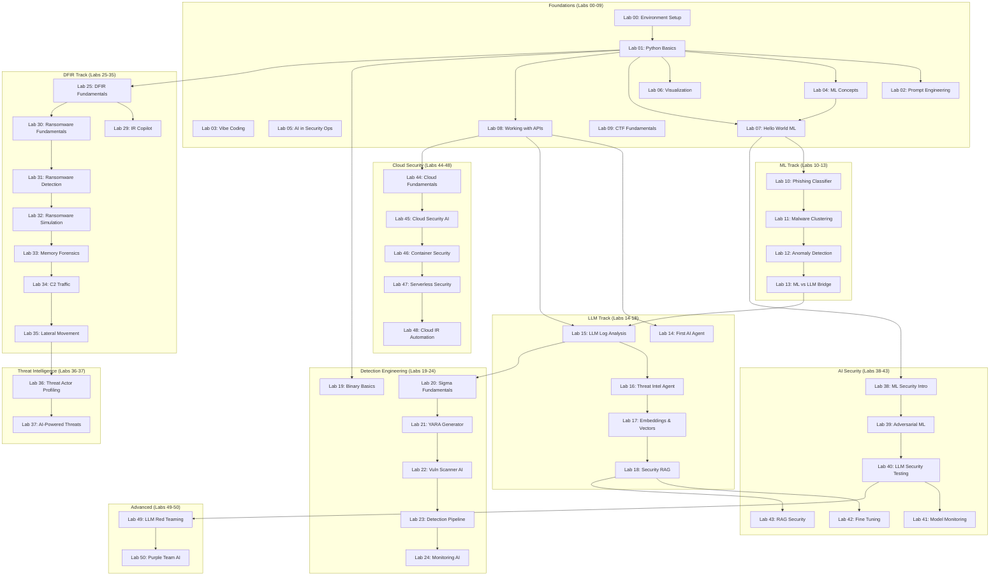

# Lab Dependency Graph

This document shows the prerequisite relationships between labs in the AI for the Win curriculum.

## Visual Overview



## Learning Paths

### Beginner Path (Start Here!)
```
Lab 00 → Lab 01 → Lab 02 → Lab 07 → Lab 10
```

### ML-Focused Path
```
Lab 01 → Lab 04 → Lab 07 → Lab 10 → Lab 11 → Lab 12 → Lab 13
```

### LLM-Focused Path
```
Lab 01 → Lab 08 → Lab 14 → Lab 15 → Lab 16 → Lab 17 → Lab 18
```

### Detection Engineering Path
```
Lab 01 → Lab 19 → Lab 20 → Lab 21 → Lab 22 → Lab 23 → Lab 24
```

### DFIR Path
```
Lab 01 → Lab 25 → Lab 29 → Lab 30 → Lab 31 → Lab 32 → Lab 33 → Lab 34 → Lab 35
```

### AI Security Path
```
Lab 07 → Lab 38 → Lab 39 → Lab 40 → Lab 41 → Lab 49 → Lab 50
```

### Cloud Security Path
```
Lab 08 → Lab 44 → Lab 45 → Lab 46 → Lab 47 → Lab 48
```

## Prerequisites Quick Reference

| Lab | Prerequisites |
|-----|---------------|
| 00 | None |
| 01 | Lab 00 |
| 02-09 | Lab 01 |
| 10 | Lab 07 |
| 11-12 | Previous lab |
| 13 | Lab 12 |
| 14-15 | Lab 08 |
| 16-18 | Previous lab |
| 19 | Lab 01 |
| 20-24 | Previous lab |
| 25 | Lab 01 |
| 29-35 | Previous lab |
| 36-37 | Previous lab |
| 38 | Lab 07 |
| 39-41 | Previous lab |
| 42-43 | Lab 18 |
| 44 | Lab 08 |
| 45-48 | Previous lab |
| 49 | Lab 40 |
| 50 | Lab 49 |
