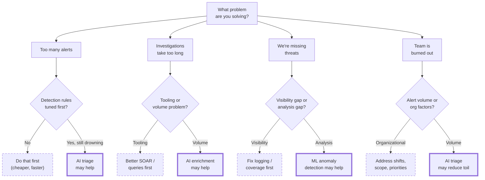
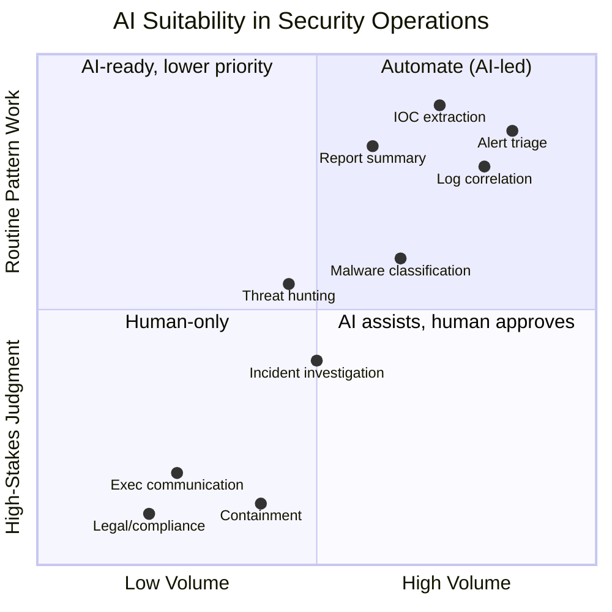
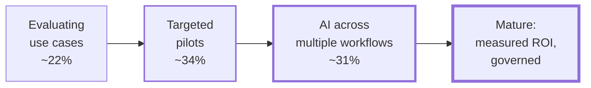
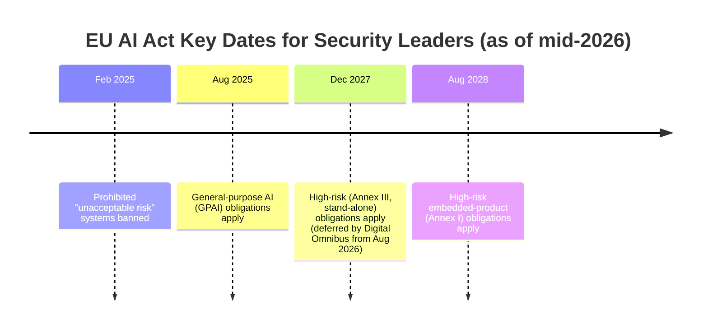

# AI for Security Leaders: Quick Reference Guide

A concise guide for security managers and executives who need to understand AI capabilities, make informed investment decisions, and lead AI-enabled security teams, without becoming ML engineers.

---

## Table of Contents

1. [Executive Summary](#executive-summary)
2. [Why Speed Matters: The Attacker Side](#why-speed-matters-the-attacker-side)
3. [What AI Can and Cannot Do in Security](#what-ai-can-and-cannot-do-in-security)
4. [AI in Practice: Example Scenarios](#ai-in-practice-example-scenarios)
5. [Decision Framework: When to Invest in AI](#decision-framework-when-to-invest-in-ai)
6. [Questions to Ask Before Implementing AI](#questions-to-ask-before-implementing-ai)
7. [Key Metrics for AI Security Programs](#key-metrics-for-ai-security-programs)
8. [Risk Considerations](#risk-considerations)
9. [Securing Your Organization's AI Use](#securing-your-organizations-ai-use)
10. [Building AI-Ready Teams](#building-ai-ready-teams)
11. [Resources for Deeper Learning](#resources-for-deeper-learning)

---

## Executive Summary

### The One-Page Version

**What AI is good at in security:**

- Processing high volumes of alerts faster than humans
- Finding patterns in large datasets (logs, network traffic)
- Extracting structured data from unstructured text (IOCs from reports)
- Summarizing and explaining technical findings
- Suggesting investigation steps based on patterns

**What AI is NOT good at (yet):**

- Making high-stakes containment decisions autonomously
- Understanding your specific business context
- Replacing human judgment on novel threats
- Guaranteeing zero false positives/negatives
- Operating without oversight

**The key principle:** AI handles volume; humans provide judgment.

### By the Numbers

> **The bottom line in one breath:** Organizations using AI and automation extensively across security operations saved an average of **$1.9M per breach** and contained breaches **80 days faster** - while the global average breach cost **fell 9% to $4.44M**.³ But shadow AI *added* ~$670K per breach,³ so **governance is the swing factor, not the technology.**

The case for (and against) AI in the SOC is now measurable. A few data points worth bringing to a budget conversation:

| The problem AI targets | The reported payoff |
| --- | --- |
| SOC teams field **~960 alerts/day** (3,000+ at large enterprises), and about **40% go completely uninvestigated**.¹ | **60% of AI adopters** cut investigation time by **≥25%**; 21% cut it by **>50%**.² |
| **61% of teams** admit they've ignored an alert that later proved to be a real incident; the average alert waits **~56 minutes** before anyone acts.¹ | Orgs using AI + automation extensively saved **$1.9M per breach** and shortened the breach lifecycle by **80 days**.³ |
| **73% of SOC analysts** report burnout and **77%** face rising alert volumes.² | The global average breach cost **fell to $4.44M** in 2025 (from $4.88M), partly attributed to faster AI-assisted response.³ |

> **Read these as direction, not guarantees.** The same reports show that AI without governance creates *new* costs - see [Securing Your Organization's AI Use](#securing-your-organizations-ai-use). Sources are listed under [Resources](#resources-for-deeper-learning).

### Quick Decision Framework

Start from the problem, not the technology. A **bold solid border** = AI may genuinely help; a **dashed border** = fix the cheaper fundamental first. (Borders are used instead of color so the diagram reads in GitHub's light, dark, and print/B&W views.)



---

## Why Speed Matters: The Attacker Side

The defensive case for AI isn't only about analyst burnout and cost - it's that **adversaries have already industrialized speed**, and a manual SOC increasingly cannot keep pace with the attack surface it has to defend.

### Attackers are faster

- **Breakout time is now measured in minutes.** The average eCrime "breakout time" - how long before an intruder moves laterally from the first compromised host - fell to **29 minutes** in 2025, with a fastest observed time of **27 seconds**; in one intrusion, data exfiltration began within **four minutes** of initial access.⁴ That is far less time than a human-only queue needs to detect, triage, and respond.
- **Most intrusions no longer use malware.** **82% of detections were malware-free**,⁴ relying on valid credentials, trusted identity flows, and approved SaaS integrations that blend into legitimate traffic.
- **Vulnerability exploitation is now the top way in.** Verizon's *2026 Data Breach Investigations Report* (31,000+ incidents across 145 countries) found software-flaw exploitation **(31%, up from 20% the prior year) overtook stolen credentials** as the leading breach vector for the first time in the report's 19-year history, with AI compressing the path from disclosure to exploitation **"from months to hours."**¹⁰
- **Shadow AI widened the attack surface.** In the same DBIR, regular employee use of unsanctioned AI tools **tripled to 45%** (from 15%), and mobile-centric phishing succeeded at a median rate **40% higher than email-based phishing**.¹⁰

### Attacks are increasingly AI-driven

This is no longer hypothetical - multiple independent reports now show AI *operationally* embedded in real campaigns:

| Development (2025–2026) | Why it matters to defenders |
| --- | --- |
| **AI is now woven through the attack lifecycle.** Verizon's 2026 DBIR, produced in partnership with Anthropic, analyzed **793 sanctioned threat actors** and found the median actor used AI assistance across **15 distinct attack techniques**; 44% of AI-assisted initial access was phishing-related and 32% involved vulnerability exploitation.¹⁰ | This is the most rigorously sourced signal of the trend: AI is a force-multiplier across recon, access, and evasion, not a single exotic event. |
| **AI-orchestrated espionage at scale.** Anthropic detected, disrupted, and publicly disclosed a campaign (tracked as GTG-1002) in which a state-linked actor used an agentic framework built on Claude to run reconnaissance, exploitation, lateral movement, and data theft against ~30 organizations, estimating the AI handled **80–90% of the tactical work**.⁵ *(As with any threat-intel disclosure, attribution and the exact autonomy figure are still debated; Anthropic itself noted the model sometimes overstated or fabricated findings - a candid look at current limits, and a reason the disclosure was useful.)* | Anthropic described the framework making **"thousands of requests, often multiple per second."** The takeaway holds regardless of the debated specifics: agentic tooling lets a single operator work at machine speed. |
| **AI-enabled malware in live operations.** Google's threat intelligence team documented malware families (PROMPTFLUX, PROMPTSTEAL) using **"just-in-time" LLM calls** to rewrite their own code and generate commands mid-execution.⁶ | Signature- and rule-based detection degrades against code that **mutates on the fly**. Detection has to shift toward behavior and anomaly analysis - where ML/AI defense earns its place. |

**The offense-defense balance is shifting, and the bottleneck is moving.** In 2026, Anthropic's defensive initiative **Project Glasswing** used a frontier model to surface **10,000+ high- or critical-severity vulnerabilities in roughly a month** across widely used software, with vendors shipping real fixes (one major browser patched 271 flaws in a single release).⁹ Independent groups - including the UK AI Security Institute - found comparable capability in other current models, which *corroborates* that this is an industry-wide trajectory rather than a single-vendor anomaly.⁹ The leadership signal is what came next: discovery got cheap, but **fixes lag badly - at the one-month mark only a fraction of disclosed high/critical bugs had been patched, each taking humans roughly two weeks, and some open-source maintainers asked for the disclosures to slow down.** AI scales discovery; humans remain the bottleneck on remediation and judgment - which is the entire argument for [redeployment over reduction](#the-headcount-paradox-lead-through-it-deliberately).

### The defender's takeaway

This is the asymmetry that justifies investment: **attackers have already automated the volume-and-speed game, so defenders who stay fully manual are bringing human reaction time to a machine-speed fight.** The point of defensive AI is not to replace analysts but to **compress detection-and-triage time to the same order of magnitude attackers now operate at** - and to free scarce human judgment for the decisions that actually need it.

> **Caveat for honesty:** these vendor and provider reports describe a *direction of travel*, not a settled measurement. "AI-driven attack" still spans a wide range - from an LLM that drafted a phishing lure to a genuinely autonomous agentic operation. Treat the headline as real and the precise magnitudes as estimates, and prioritize based on your own telemetry and threat model.

---

## What AI Can and Cannot Do in Security

### Realistic Expectations by Task

| Security Task                   | AI Suitability | Notes                                                     |
| ------------------------------- | -------------- | --------------------------------------------------------- |
| **Alert triage**                | High           | Pattern matching at scale, but sample human review needed |
| **Log correlation**             | High           | Finding connections in large datasets                     |
| **IOC extraction**              | High           | Parsing unstructured text into structured data            |
| **Threat report summarization** | High           | Natural language understanding                            |
| **Threat hunting hypothesis**   | Medium         | Can suggest, but needs human validation                   |
| **Incident investigation**      | Medium         | Assists but doesn't replace analyst judgment              |
| **Malware classification**      | Medium-High    | Good for known families, weaker on novel samples          |
| **Containment decisions**       | Low            | High stakes, business impact requires human approval      |
| **Executive communication**     | Low            | Requires organizational context humans provide            |
| **Legal/compliance decisions**  | Low            | Human accountability required                             |

The same table, plotted by **how much volume** the task involves versus **how much human judgment** the decision carries. The top-right is where AI pays off first; the bottom is where a human stays accountable:



### ML vs LLM: When to Use Each

| Approach                                            | Best For                                         | Cost                    | Speed        |
| --------------------------------------------------- | ------------------------------------------------ | ----------------------- | ------------ |
| **Traditional ML** (classifiers, anomaly detection) | High-volume structured data, real-time detection | Very low per prediction | Milliseconds |
| **Large Language Models** (Claude, GPT, Gemini)     | Unstructured text, reasoning, generation         | Higher per prediction   | Seconds      |
| **Hybrid** (ML filter → LLM analysis)               | Production pipelines, cost optimization          | Optimized               | Varies       |

**Rule of thumb:** Use ML for volume, LLM for depth.

---

## AI in Practice: Example Scenarios

Frameworks are abstract; these short scenarios show what the principles look like on a real team. Each maps to a hands-on lab or command in this course so your analysts can try it.

### 1. The hybrid triage pipeline (the "AI handles volume" pattern)

A mid-size SOC drowning in ~2,500 alerts/day puts a cheap ML classifier in front of an LLM:

1. **ML filter** scores every alert in milliseconds and auto-suppresses the obvious noise (e.g., known-benign scanner traffic), cutting volume ~70%.
2. **LLM enrichment** takes the survivors, pulls in asset context and threat intel, and drafts a plain-language summary plus suggested next steps.
3. **Analyst** reviews only the enriched, prioritized queue and owns the decision to escalate or close.

*Why it works:* each layer does what it's cheapest at. *Watch:* track the ML layer's false-negative rate - suppression is where real threats get silently lost. → *Try it: [Lab 23: Detection Pipeline](../../labs/lab23-detection-pipeline/), [Lab 13: ML vs LLM](../../labs/lab13-ml-vs-llm/).*

### 2. Turning a threat report into action (the "extract structure from text" pattern)

An analyst pastes a 20-page threat-intel PDF into an LLM-backed workflow and gets back a clean table of IOCs (IPs, domains, hashes), mapped MITRE ATT&CK techniques, and a one-paragraph "does this affect us?" summary checked against the asset inventory - in minutes instead of an afternoon. → *Try it: `/ioc-extractor` and `/threat-intel`, [Lab 16: Threat Intel Agent](../../labs/lab16-threat-intel-agent/).*

### 3. A cautionary tale (when oversight slips)

A team proud of its rising auto-close rate quietly stopped sampling closed alerts. Three months later, an incident traced back to a category the model had been auto-closing with high confidence - the alerts were real, the model was wrong, and no human ever looked. The fix wasn't "less AI"; it was restoring a small **random human-review sample** of auto-closed alerts and watching the false-negative rate. *This is exactly the failure the [Warning Signs](#warning-signs) and metrics below are designed to catch.*

---

## Decision Framework: When to Invest in AI

Most organizations don't decide "AI or not" once - they move along a maturity curve. As of 2025, ~**87% of orgs** are somewhere on this path; the rough distribution looks like this (Gurucul, *Pulse of the AI SOC 2025*). Use it to locate yourself and to set a realistic next step rather than skipping ahead:



### Prerequisites Checklist

Before investing in AI, ensure these foundations are in place:

- [ ] **Asset inventory** is reasonably complete
- [ ] **Logging coverage** meets your visibility needs
- [ ] **Detection rules** are tuned (not generating excessive false positives)
- [ ] **Incident response processes** are documented
- [ ] **Team has bandwidth** to implement and maintain AI tools
- [ ] **Budget exists** for ongoing API costs or infrastructure

### Investment Decision Matrix

| Your Situation                      | Recommendation                        |
| ----------------------------------- | ------------------------------------- |
| Foundations incomplete              | Address fundamentals first            |
| Small team (1-3), manageable volume | Start with LLM for enrichment only    |
| Medium team (4-10), high volume     | Consider ML triage + LLM analysis     |
| Large team (10+), enterprise scale  | Full pipeline with checkpoints        |
| Sensitive/classified data           | Evaluate local/on-premise models      |
| Limited budget                      | Use free tiers, local models (Ollama) |

> **Don't overlook local / open-source models.** For sensitive, regulated, or air-gapped environments, self-hosted open-weight models (run via Ollama, vLLM, etc.) keep data entirely inside your boundary - no prompts leave the network, sidestepping much of the data-leakage and shadow-AI risk discussed later. The trade-off is that *you* own the GPUs, updates, and tuning. This course's labs are provider-agnostic and run against local models, so teams can prototype without sending a single byte to an external API.

### Build vs Buy Considerations

| Factor                 | Build In-House         | Buy/SaaS                  |
| ---------------------- | ---------------------- | ------------------------- |
| **Customization**      | Full control           | Limited to vendor options |
| **Time to value**      | Months                 | Days to weeks             |
| **Maintenance**        | Your responsibility    | Vendor responsibility     |
| **Data privacy**       | You control            | Review vendor policies    |
| **Cost (initial)**     | Lower (API costs)      | Higher (licensing)        |
| **Cost (ongoing)**     | API + engineering time | Subscription              |
| **Expertise required** | ML/AI skills needed    | Less technical            |

### What It Actually Costs (a worked example)

Leaders ask "how much?" and get vague answers. Here's an order-of-magnitude model for **LLM-based alert triage**. Plug in *current* provider prices - they change often, so treat the rates below as illustrative, not quotes. (See the [Cost Management Guide](./cost-management.md) for live numbers.)

Assume **2,500 alerts/day** and a triage prompt of roughly **3K input + 500 output tokens** each.

| Approach | Tokens/day (rough) | Illustrative monthly cost\* | Notes |
| --- | --- | --- | --- |
| **LLM on every alert** | ~8.75M in / 1.25M out | **$$$** | Simplest, but you pay to read noise |
| **Hybrid: ML filter → LLM** | ~2.6M in / 0.4M out (after ~70% filtered) | **~⅓ of above** | The ML pre-filter is near-free per prediction |
| **Local / open-source model** | n/a (self-hosted) | Infra + ops time, no per-token fee | Best for sensitive data; you own the GPUs and tuning |

\* *Multiply your tokens by the model's per-million input/output price. As an illustrative anchor (verify against current pricing): at roughly **$3 per million input tokens** for a mid-tier model, the hybrid pipeline above runs on the order of a few hundred dollars/month, while running a frontier model on every alert can be 10–20× that. A cheaper mid-tier model can be 10–20× less than a frontier model for the same volume - so **routing easy alerts to a small model and only escalating hard ones to a frontier model** is often the biggest single cost lever.*

**The leadership takeaway:** the dominant cost driver isn't the model's sticker price - it's **how many tokens you send and which model you send them to.** Filter first, route by difficulty, and reserve frontier models for the hard cases. Don't forget the *non-token* costs: engineering time, prompt/eval maintenance, and monitoring.

---

## Questions to Ask Before Implementing AI

### Questions for Your Team

1. **What specific problem will AI solve?** (Be precise, not "improve security")
2. **How will we measure success?** (Define metrics before implementation)
3. **What happens when AI is wrong?** (False positives and false negatives)
4. **Who reviews AI decisions?** (Human-in-the-loop requirements)
5. **How will we maintain this?** (Models degrade, prompts need tuning)
6. **What's our rollback plan?** (If AI fails, how do we operate?)

### Questions for Vendors

1. **What data do you send to AI providers?** (Privacy implications)
2. **How is the model trained?** (On whose data? How often updated?)
3. **What are the false positive/negative rates?** (In environments like ours)
4. **How does pricing scale?** (Per alert, per user, per endpoint?)
5. **What happens during AI outages?** (Failover capabilities)
6. **How do you handle prompt injection attacks?** (LLM security)
7. **What compliance certifications do you have?** (SOC 2, ISO 27001, etc.)

### Questions for Yourself

1. **Am I solving a real problem or chasing a trend?**
2. **Have I tried simpler solutions first?**
3. **Does my team have capacity to implement this well?**
4. **What's the cost of getting this wrong?**

---

## Key Metrics for AI Security Programs

### Operational Metrics

| Metric                         | What It Measures                         | Target Direction       |
| ------------------------------ | ---------------------------------------- | ---------------------- |
| **Mean Time to Triage (MTTT)** | How fast alerts are initially assessed   | Decrease               |
| **Alert-to-Analyst Ratio**     | Volume per analyst after AI filtering    | Decrease               |
| **False Positive Rate**        | Alerts incorrectly flagged as threats    | Decrease               |
| **False Negative Rate**        | Real threats missed by AI                | Minimize (critical)    |
| **Auto-close Rate**            | Alerts closed without human review       | Monitor (not maximize) |
| **Escalation Accuracy**        | % of escalations that are true positives | Increase               |

### Quality Metrics

| Metric                       | What It Measures                    | Target Direction     |
| ---------------------------- | ----------------------------------- | -------------------- |
| **Human Override Rate**      | How often analysts disagree with AI | Monitor trends       |
| **Time Savings per Analyst** | Hours saved on routine tasks        | Increase             |
| **Investigation Depth**      | Evidence collected per incident     | Maintain or increase |
| **Detection Coverage**       | % of attack techniques detectable   | Increase             |

### Warning Signs

- **Auto-close rate increasing without validation** → May be missing threats
- **Human override rate very low** → Analysts may be rubber-stamping AI
- **Human override rate very high** → AI may not be well-tuned
- **False negative rate unknown** → You're flying blind

---

## Risk Considerations

### AI-Specific Risks

| Risk                   | Description                                | Mitigation                      |
| ---------------------- | ------------------------------------------ | ------------------------------- |
| **Prompt injection**   | Attackers manipulate AI via crafted inputs | Input validation, sandboxing    |
| **Data leakage**       | Sensitive data sent to AI providers        | Data minimization, local models |
| **Model manipulation** | Adversarial inputs evade detection         | Ensemble models, human review   |
| **Over-reliance**      | Analysts stop thinking critically          | Maintain human oversight        |
| **Vendor lock-in**     | Dependency on single AI provider           | Multi-provider strategy         |
| **Model deprecation / drift** | Providers retire models or change behavior on upgrade, silently shifting detection quality | Pin versions; re-run eval suite before adopting a new model; track provider deprecation notices |
| **Cost overruns**      | API costs exceed budget                    | Usage monitoring, limits        |

### Compliance Considerations

| Regulation      | AI Implications                                             |
| --------------- | ----------------------------------------------------------- |
| **GDPR**        | Right to explanation (Art. 22), data processing limits      |
| **HIPAA**       | PHI in prompts requires BAAs with AI providers              |
| **PCI-DSS**     | Cardholder data handling, audit requirements                |
| **SOX**         | Explainability for AI-assisted financial security decisions |
| **EU AI Act**   | Risk-tiered obligations on a phased calendar (see below); high-risk systems require risk management, human oversight, logging, transparency, and cybersecurity |
| **NIST AI RMF** | Voluntary framework; the **Generative AI Profile (NIST AI 600-1, July 2024)** adds 12 GenAI-specific risk categories |

**EU AI Act - the dates a security leader actually needs.** Obligations phase in over several years, and the calendar moved in 2026: the *Digital Omnibus* package (proposed November 2025) reached political agreement in **early May 2026**, deferring the main high-risk deadlines and tying them to when supporting standards and guidance are available. Formal adoption was still pending as of mid-2026, so confirm specifics with counsel - but the agreed shape of the calendar is:



---

## Securing Your Organization's AI Use

Most of this guide is about **AI the SOC uses**. But by 2025 every security leader has a second mandate: **governing the AI the rest of the organization is already using** - often without telling you. This is now a measurable source of breach cost, not a hypothetical.

### Why this is on your desk now

From IBM's *Cost of a Data Breach 2025*:

- **1 in 5 organizations** reported a breach traced to **shadow AI** (unsanctioned AI tools), adding ~**$670K** to the average breach cost.
- **13% of organizations** reported a breach of their **own AI models or applications** - and **97% of those lacked basic AI access controls**.
- **63%** of breached organizations had **no AI governance policy** (or one still in draft).
- In shadow-AI breaches, compromised customer PII jumped to roughly **two-thirds** of cases.

The takeaway: the fastest-growing AI risk for most orgs isn't an exotic adversarial attack - it's **employees pasting sensitive data into unsanctioned tools** and **AI features shipped without access controls**.

### A starter checklist for AI governance

```
□ Inventory AI use - sanctioned tools AND shadow AI (browser extensions, copilots, pasted prompts)
□ Acceptable-use policy - what data may/may not go into which AI tools
□ Access controls on internal AI apps - authn/authz, least privilege, rate limits
□ Data-loss controls - DLP rules for prompts; block/sanction risky endpoints
□ Vendor due diligence - data retention, training-on-your-data, sub-processors
□ Logging & monitoring - who is using which AI tool, with what data
□ Incident playbook - what to do when sensitive data leaks into a model
□ Map to a framework - OWASP LLM / Agentic Top 10, NIST AI 600-1, MITRE ATLAS
```

### Don't forget agentic AI

As teams adopt AI **agents** that take actions (run queries, call APIs, touch ticketing/EDR), the blast radius of a single prompt-injection or over-permissioned tool grows sharply - and, as the [attacker-side section](#why-speed-matters-the-attacker-side) shows, adversaries are already weaponizing agentic frameworks against defenders. OWASP's 2025 work splits **"excessive agency"** into three root causes worth designing against: excessive **functionality**, excessive **permissions**, and excessive **autonomy** (high-impact actions with no human in the loop). Scope agent tools narrowly, run them with least privilege, and keep a human approval step on anything destructive or outward-facing. → *See [Lab 49: LLM Red Teaming](../../labs/lab49-llm-red-teaming/) and [Lab 43: RAG Security](../../labs/lab43-rag-security/).*

---

## Building AI-Ready Teams

### The Headcount Paradox (lead through it deliberately)

There's an uncomfortable trend running underneath everything above: even as attacks accelerate, security teams are being cut, with AI cited as the justification. In Mercer's 2026 *Global Talent Trends* report, **99% of surveyed C-suite executives said they expect AI to drive at least some headcount reduction within two years**⁸ - though the same survey found **65% expect to redeploy or reskill 11–30% of their workforce rather than simply cut it**, so "at least some reduction" spans a wide range from trimming a few roles to restructuring a team. Several security vendors, meanwhile, ran 2025–2026 layoffs that explicitly named "AI efficiency" as a reason.

The workforce data says proceed carefully. The **2025 ISC2 Cybersecurity Workforce Study** actually **stopped publishing a single workforce-gap figure**, shifting to a skills-based view of the problem - but the economic signal is the headline: **budget reductions are now the leading driver of staff shortages** (33% of organizations say they can't afford to staff adequately; 29% can't afford the skills they need), and **skills gaps have overtaken raw headcount** as the top concern.⁷ The widely circulated **~4.8M global gap** comes from the *prior* (2024) study. In other words, much of the "AI is replacing analysts" narrative is really cost-cutting wearing an AI label; independent analysis finds many of these cuts show no clear business case.

For a security leader, the paradox *is* the risk: cut human capacity while the attack surface and attacker speed grow (see [Why Speed Matters](#why-speed-matters-the-attacker-side)), and you widen the exact gap AI was supposed to close, while removing the human-judgment layer this guide spends ten sections defending. The defensible posture is **redeployment, not reduction**: let AI absorb the repetitive volume so your existing people move up to investigation, threat hunting, detection engineering, and oversight, the work that genuinely needs a human. Treat any "AI lets us run security with fewer people" pitch the way you'd treat a vendor promising to "eliminate false positives": with the metrics from this guide, and healthy skepticism.

> **Bridge to the rest of this section:** the team moves below assume you're reskilling and redeploying people, not shedding them. AI's dividend is capacity you reinvest in judgment, not just a line you cut.

### Skills to Develop

| Skill                   | Who Needs It                 | How to Develop              |
| ----------------------- | ---------------------------- | --------------------------- |
| **Prompt engineering**  | All analysts                 | Labs 02, 15 in this course |
| **ML fundamentals**     | Senior analysts, engineers   | Labs 04, 13                |
| **AI tool evaluation**  | Managers, architects         | Lab 05, this guide         |
| **AI security testing** | Red team, security engineers | Labs 40, 43, 49            |

### Team Structure Considerations

- **Don't create an "AI team" in isolation** - Integrate AI skills across existing roles
- **Designate AI champions** - 1-2 people who stay current on AI developments
- **Maintain traditional skills** - AI augments, doesn't replace, security fundamentals
- **Plan for maintenance** - Someone needs to own prompt tuning, model monitoring

### Change Management

1. **Start small** - Pilot with one use case, one team
2. **Measure before and after** - Establish baseline metrics
3. **Get analyst buy-in** - They're the users, involve them early
4. **Communicate wins and failures** - Build trust through transparency
5. **Iterate** - AI implementations improve with feedback

### A 30/60/90-Day Starter Plan

A concrete first quarter that front-loads measurement and keeps risk low:

| Phase | Focus | Key actions |
| --- | --- | --- |
| **Days 1–30: Baseline** | Know your starting point | Pick **one** high-volume use case (usually alert triage). Capture baseline metrics (MTTT, alert-to-analyst ratio, false-positive rate). Confirm the [prerequisites](#prerequisites-checklist) are met. Stand up a quick AI acceptable-use policy. |
| **Days 31–60: Pilot** | Prove it on a slice | Run AI on a *subset* of traffic with a human reviewing **every** output. Compare against baseline. Track human override and false-negative rates from day one. |
| **Days 61–90: Decide** | Measure, then expand or stop | Review pilot metrics honestly. If it helps, expand scope and add sampling-based oversight; if not, document why and stop. Either way, write down what you learned. |

**Rule:** don't scale a use case until you can show a before/after number. No baseline, no expansion.

---

## Resources for Deeper Learning

### In This Course

| Resource                                                                            | What You'll Learn                | Time      |
| ----------------------------------------------------------------------------------- | -------------------------------- | --------- |
| [Lab 05: AI in Security Operations](../../labs/lab05-ai-in-security-operations/)  | Comprehensive strategic overview | 1-2 hours |
| [Lab 04: ML Concepts Primer](../../labs/lab04-ml-concepts-primer/)                | What ML can/can't do             | 1-2 hours |
| [Lab 02: Intro to Prompt Engineering](../../labs/lab02-intro-prompt-engineering/) | How LLMs work                    | 1-2 hours |
| [Lab 15: LLM Log Analysis](../../labs/lab15-llm-log-analysis/)                      | Hands-on LLM experience          | 2-3 hours |
| [Security Compliance Guide](./security-compliance-guide.md)                         | SOC 2, GDPR, NIST mapping        | Reference |
| [Cost Management Guide](./cost-management.md)                                       | Budget planning                  | Reference |
| [Security-to-AI Glossary](../../resources/security-to-ai-glossary.md)               | Plain-language AI terms (RAG, agentic, prompt injection, MTTR…) | Reference |

### External Resources

**Frameworks and Standards:**

- [OWASP Top 10 for LLM Applications (2025)](https://genai.owasp.org/llm-top-10/) - The current edition; prompt injection remains #1, with an expanded "excessive agency" entry
- [OWASP Top 10 for Agentic Applications (Dec 2025)](https://genai.owasp.org/) - Newer companion list for AI systems that take autonomous, multi-step actions
- [NIST AI Risk Management Framework](https://www.nist.gov/itl/ai-risk-management-framework) and the [Generative AI Profile (NIST AI 600-1)](https://www.nist.gov/publications/artificial-intelligence-risk-management-framework-generative-artificial-intelligence) - Voluntary risk management; the GenAI profile adds 12 GenAI-specific risk categories
- [MITRE ATLAS](https://atlas.mitre.org/) - Adversarial ML / AI threat framework (the ATT&CK analog for AI systems)
- [EU AI Act - official timeline](https://artificialintelligenceact.eu/implementation-timeline/) - Phased obligations, with the Digital Omnibus adjustments tracked through 2026–2028

**Industry Reports (data cited in this guide):**

- [IBM, *Cost of a Data Breach 2025*](https://www.ibm.com/reports/data-breach) - AI/automation savings ($1.9M/breach, 80 days), shadow-AI cost, AI governance gaps _(superscript ³ above)_
- *Pulse of the AI SOC 2025* ([Gurucul](https://gurucul.com/blog/2025-pulse-of-the-ai-soc-ai-enters-the-equation/)) - AI adoption maturity, investigation-time reductions, analyst burnout (73%) and rising alert volumes (77%) _(superscript ²)_
- [The State of AI in the SOC 2025](https://thehackernews.com/2025/09/the-state-of-ai-in-soc-2025-insights.html) (Prophet Security) - Alert volume (~960/day avg, 3,000+ at large enterprises), ~40% of alerts uninvestigated, ~56 min before an alert is acted on, 61% have ignored a later-confirmed incident _(superscript ¹)_
- [CrowdStrike, *2026 Global Threat Report*](https://www.crowdstrike.com/en-us/global-threat-report/) - Breakout time (29 min avg / 27 sec fastest, 65% faster YoY), 82% malware-free, AI-enabled adversary activity +89% YoY _(superscript ⁴)_
- [Verizon, *2026 Data Breach Investigations Report*](https://www.verizon.com/business/resources/reports/dbir/) - 31,000+ incidents; vulnerability exploitation (31%, up from 20%) overtakes stolen credentials for the first time in 19 years; AI-assisted technique analysis of 793 threat actors (with Anthropic); shadow-AI use tripled to 45% _(superscript ¹⁰)_
- [Anthropic, *Disrupting the first reported AI-orchestrated cyber espionage campaign* (Nov 2025)](https://www.anthropic.com/news/disrupting-AI-espionage) - GTG-1002, 80–90% autonomous, machine-speed operation _(superscript ⁵)_
- [Google Threat Intelligence Group, *Advances in Threat Actor Usage of AI Tools* (Nov 2025)](https://cloud.google.com/blog/topics/threat-intelligence/threat-actor-usage-of-ai-tools) - PROMPTFLUX / PROMPTSTEAL, "just-in-time" AI-enabled malware _(superscript ⁶)_
- [ISC2, *2025 Cybersecurity Workforce Study*](https://www.isc2.org/Insights/2025/12/2025-ISC2-Cybersecurity-Workforce-Study) - budget cuts now the top driver of staff shortages, skills gaps eclipse headcount, no workforce-gap estimate published this year _(superscript ⁷)_
- [Mercer, *2026 Global Talent Trends*](https://www.mercer.com/insights/people-strategy/future-of-work/global-talent-trends/) - of ~12,000 respondents, 99% of the 825 C-suite executives surveyed expect AI to drive at least some headcount reduction within two years; 65% expect to redeploy or reskill 11–30% of their workforce _(superscript ⁸)_
- [Anthropic, *Project Glasswing / Claude Mythos Preview* (2026)](https://www.anthropic.com/glasswing) - 10,000+ high/critical vulnerabilities surfaced in ~1 month; the [UK AI Security Institute](https://www.cnbc.com/2026/05/08/anthropic-mythos-ai-cybersecurity-banks.html) and independent researchers report comparable capability from other current models, so treat it as an industry-wide trajectory, not a single-vendor leap _(superscript ⁹)_
- SANS Detection & Response Survey (annual) - SOC challenges and trends
- Gartner Hype Cycle for Security Operations - Technology maturity assessment

> ¹ State of AI in the SOC 2025 (Prophet Security) · ² Gurucul *Pulse of the AI SOC 2025* · ³ IBM *Cost of a Data Breach 2025* · ⁴ CrowdStrike *2026 Global Threat Report* · ⁵ Anthropic *AI-orchestrated espionage* (Nov 2025) · ⁶ Google Threat Intelligence Group (Nov 2025) · ⁷ ISC2 *2025 Cybersecurity Workforce Study* (16,029 respondents; the ~4.8M figure is carried forward from the 2024 study) · ⁸ Mercer *2026 Global Talent Trends* · ⁹ Anthropic *Project Glasswing / Claude Mythos* (2026), capability characterized by the UK AI Security Institute and independent researchers as comparable across current frontier models · ¹⁰ Verizon *2026 Data Breach Investigations Report* (with Anthropic). Vendor-sponsored surveys and provider threat reports vary in methodology - treat figures as directional and validate against your own baseline.

**Books for Leaders:**

- "AI-Powered Cybersecurity" by Dr. Raef Meeuwisse - Strategic overview
- "The CISO's Guide to AI" - Executive-level AI security strategy

---

## Quick Reference Card

### AI Investment Readiness Checklist

Foundations come from the [Prerequisites Checklist](#prerequisites-checklist) above (logging, detection tuning, processes, capacity, budget). Once those are met, confirm you're *decision*-ready:

```
□ Clear problem statement (not "use AI")
□ Baseline metrics established (you can show before/after)
□ Human-in-the-loop requirements defined
□ Rollback plan if AI fails
□ Compliance requirements understood
□ AI governance / acceptable-use policy in place
```

### Red Flags When Evaluating AI Solutions

- Promises to "eliminate" false positives or "guarantee" detection
- No discussion of human oversight requirements
- Vague about data handling and privacy
- Can't explain how the AI works at a high level
- No metrics on false negative rates
- Pricing that scales unpredictably

### Golden Rules for Security AI

1. **AI augments humans, doesn't replace them**
2. **Start with clear problems, not cool technology**
3. **Measure before and after, or you're guessing**
4. **Human oversight scales with decision impact**
5. **Models degrade - plan for maintenance**
6. **Simpler solutions may work better**
7. **Match the adversary's speed - they've already automated**
8. **AI's dividend is redeployment, not reduction - don't cut the judgment layer you depend on**

---

## Next Steps

1. **Assess your readiness** using the checklist above
2. **Complete Lab 05** for a deeper strategic understanding
3. **Try Lab 15** for hands-on LLM experience (2-3 hours)
4. **Evaluate one specific use case** using the decision framework
5. **Pilot small**, measure results, then expand

---

_This guide is part of the [AI for the Win](../../README.md) training program - a hands-on course for security practitioners building AI-powered tools._

_Last updated: June 2026_
