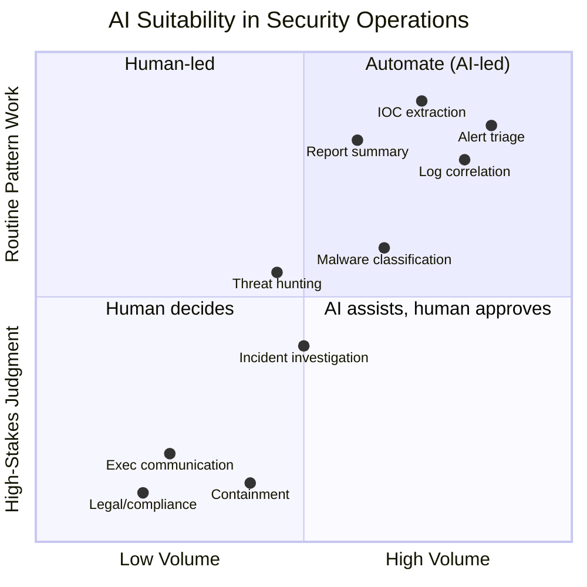
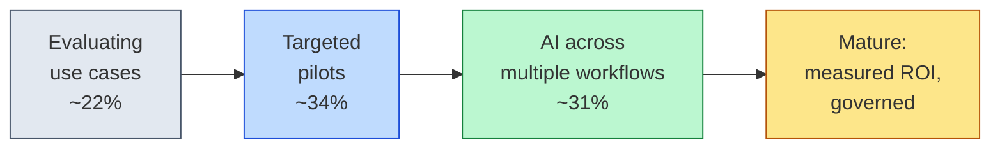
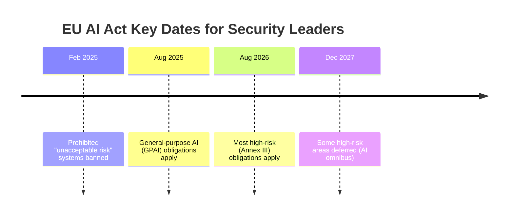

# AI for Security Leaders: Quick Reference Guide

A concise guide for security managers and executives who need to understand AI capabilities, make informed investment decisions, and lead AI-enabled security teams—without becoming ML engineers.

---

## Table of Contents

1. [Executive Summary](#executive-summary)
2. [What AI Can and Cannot Do in Security](#what-ai-can-and-cannot-do-in-security)
3. [AI in Practice: Example Scenarios](#ai-in-practice-example-scenarios)
4. [Decision Framework: When to Invest in AI](#decision-framework-when-to-invest-in-ai)
5. [Questions to Ask Before Implementing AI](#questions-to-ask-before-implementing-ai)
6. [Key Metrics for AI Security Programs](#key-metrics-for-ai-security-programs)
7. [Risk Considerations](#risk-considerations)
8. [Securing Your Organization's AI Use](#securing-your-organizations-ai-use)
9. [Building AI-Ready Teams](#building-ai-ready-teams)
10. [Resources for Deeper Learning](#resources-for-deeper-learning)

---

## Executive Summary

### The One-Page Version

**What AI is good at in security:**

- Processing high volumes of alerts faster than humans
- Finding patterns in large datasets (logs, network traffic)
- Extracting structured data from unstructured text (IOCs from reports)
- Summarizing and explaining technical findings
- Suggesting investigation steps based on patterns

**What AI is NOT good at (yet):**

- Making high-stakes containment decisions autonomously
- Understanding your specific business context
- Replacing human judgment on novel threats
- Guaranteeing zero false positives/negatives
- Operating without oversight

**The key principle:** AI handles volume; humans provide judgment.

### By the Numbers (2025)

The case for (and against) AI in the SOC is now measurable. A few data points worth bringing to a budget conversation:

| The problem AI targets | The reported payoff |
| --- | --- |
| SOC teams field **~960–3,000 alerts/day**, and roughly **63% go unaddressed**.¹ | **60% of AI adopters** cut investigation time by **≥25%**; 21% cut it by **>50%**.² |
| Enterprise false-positive rates frequently **exceed 50%**, consuming over half of analyst time.¹ | Orgs using AI + automation extensively saved **$1.9M per breach** and shortened the breach lifecycle by **80 days**.³ |
| **71% of SOC analysts** report burnout; **64%** are considering leaving within a year.¹ | The global average breach cost **fell to $4.44M** in 2025 (from $4.88M), partly attributed to faster AI-assisted response.³ |

> **Read these as direction, not guarantees.** The same reports show that AI without governance creates *new* costs — see [Securing Your Organization's AI Use](#securing-your-organizations-ai-use). Sources are listed under [Resources](#resources-for-deeper-learning).

### Quick Decision Framework

```
Should you invest in AI for security?

┌─────────────────────────────────────────────────────────────────┐
│ START: What problem are you solving?                            │
├─────────────────────────────────────────────────────────────────┤
│                                                                 │
│ "Too many alerts"                                               │
│   └─► Have you tuned detection rules first?                     │
│       ├─► No → Do that first (cheaper, faster impact)           │
│       └─► Yes, still drowning → AI triage may help              │
│                                                                 │
│ "Investigations take too long"                                  │
│   └─► Is it a tooling problem or volume problem?                │
│       ├─► Tooling → Better SOAR/queries may help first          │
│       └─► Volume → AI enrichment may help                       │
│                                                                 │
│ "We're missing threats"                                         │
│   └─► Is it a visibility gap or analysis gap?                   │
│       ├─► Visibility → Fix logging/coverage first               │
│       └─► Analysis → ML anomaly detection may help              │
│                                                                 │
│ "Our team is burned out"                                        │
│   └─► Is it alert volume or organizational factors?             │
│       ├─► Organizational → Address shifts, scope, priorities    │
│       └─► Volume → AI triage may reduce toil                    │
│                                                                 │
└─────────────────────────────────────────────────────────────────┘
```

---

## What AI Can and Cannot Do in Security

### Realistic Expectations by Task

| Security Task                   | AI Suitability | Notes                                                     |
| ------------------------------- | -------------- | --------------------------------------------------------- |
| **Alert triage**                | High           | Pattern matching at scale, but sample human review needed |
| **Log correlation**             | High           | Finding connections in large datasets                     |
| **IOC extraction**              | High           | Parsing unstructured text into structured data            |
| **Threat report summarization** | High           | Natural language understanding                            |
| **Threat hunting hypothesis**   | Medium         | Can suggest, but needs human validation                   |
| **Incident investigation**      | Medium         | Assists but doesn't replace analyst judgment              |
| **Malware classification**      | Medium-High    | Good for known families, weaker on novel samples          |
| **Containment decisions**       | Low            | High stakes, business impact requires human approval      |
| **Executive communication**     | Low            | Requires organizational context humans provide            |
| **Legal/compliance decisions**  | Low            | Human accountability required                             |

The same table, plotted by **how much volume** the task involves versus **how much human judgment** the decision carries. The top-right is where AI pays off first; the bottom is where a human stays accountable:



### ML vs LLM: When to Use Each

| Approach                                            | Best For                                         | Cost                    | Speed        |
| --------------------------------------------------- | ------------------------------------------------ | ----------------------- | ------------ |
| **Traditional ML** (classifiers, anomaly detection) | High-volume structured data, real-time detection | Very low per prediction | Milliseconds |
| **Large Language Models** (Claude, GPT, Gemini)     | Unstructured text, reasoning, generation         | Higher per prediction   | Seconds      |
| **Hybrid** (ML filter → LLM analysis)               | Production pipelines, cost optimization          | Optimized               | Varies       |

**Rule of thumb:** Use ML for volume, LLM for depth.

---

## AI in Practice: Example Scenarios

Frameworks are abstract; these short scenarios show what the principles look like on a real team. Each maps to a hands-on lab or command in this course so your analysts can try it.

### 1. The hybrid triage pipeline (the "AI handles volume" pattern)

A mid-size SOC drowning in ~2,500 alerts/day puts a cheap ML classifier in front of an LLM:

1. **ML filter** scores every alert in milliseconds and auto-suppresses the obvious noise (e.g., known-benign scanner traffic), cutting volume ~70%.
2. **LLM enrichment** takes the survivors, pulls in asset context and threat intel, and drafts a plain-language summary plus suggested next steps.
3. **Analyst** reviews only the enriched, prioritized queue and owns the decision to escalate or close.

*Why it works:* each layer does what it's cheapest at. *Watch:* track the ML layer's false-negative rate — suppression is where real threats get silently lost. → *Try it: [Lab 23: Detection Pipeline](../../labs/lab23-detection-pipeline/), [Lab 13: ML vs LLM](../../labs/lab13-ml-vs-llm/).*

### 2. Turning a threat report into action (the "extract structure from text" pattern)

An analyst pastes a 20-page threat-intel PDF into an LLM-backed workflow and gets back a clean table of IOCs (IPs, domains, hashes), mapped MITRE ATT&CK techniques, and a one-paragraph "does this affect us?" summary checked against the asset inventory — in minutes instead of an afternoon. → *Try it: `/ioc-extractor` and `/threat-intel`, [Lab 16: Threat Intel Agent](../../labs/lab16-threat-intel-agent/).*

### 3. A cautionary tale (when oversight slips)

A team proud of its rising auto-close rate quietly stopped sampling closed alerts. Three months later, an incident traced back to a category the model had been auto-closing with high confidence — the alerts were real, the model was wrong, and no human ever looked. The fix wasn't "less AI"; it was restoring a small **random human-review sample** of auto-closed alerts and watching the false-negative rate. *This is exactly the failure the [Warning Signs](#warning-signs) and metrics below are designed to catch.*

---

## Decision Framework: When to Invest in AI

Most organizations don't decide "AI or not" once — they move along a maturity curve. As of 2025, ~**87% of orgs** are somewhere on this path; the rough distribution looks like this (Gurucul, *Pulse of the AI SOC 2025*). Use it to locate yourself and to set a realistic next step rather than skipping ahead:



### Prerequisites Checklist

Before investing in AI, ensure these foundations are in place:

- [ ] **Asset inventory** is reasonably complete
- [ ] **Logging coverage** meets your visibility needs
- [ ] **Detection rules** are tuned (not generating excessive false positives)
- [ ] **Incident response processes** are documented
- [ ] **Team has bandwidth** to implement and maintain AI tools
- [ ] **Budget exists** for ongoing API costs or infrastructure

### Investment Decision Matrix

| Your Situation                      | Recommendation                        |
| ----------------------------------- | ------------------------------------- |
| Foundations incomplete              | Address fundamentals first            |
| Small team (1-3), manageable volume | Start with LLM for enrichment only    |
| Medium team (4-10), high volume     | Consider ML triage + LLM analysis     |
| Large team (10+), enterprise scale  | Full pipeline with checkpoints        |
| Sensitive/classified data           | Evaluate local/on-premise models      |
| Limited budget                      | Use free tiers, local models (Ollama) |

### Build vs Buy Considerations

| Factor                 | Build In-House         | Buy/SaaS                  |
| ---------------------- | ---------------------- | ------------------------- |
| **Customization**      | Full control           | Limited to vendor options |
| **Time to value**      | Months                 | Days to weeks             |
| **Maintenance**        | Your responsibility    | Vendor responsibility     |
| **Data privacy**       | You control            | Review vendor policies    |
| **Cost (initial)**     | Lower (API costs)      | Higher (licensing)        |
| **Cost (ongoing)**     | API + engineering time | Subscription              |
| **Expertise required** | ML/AI skills needed    | Less technical            |

---

## Questions to Ask Before Implementing AI

### Questions for Your Team

1. **What specific problem will AI solve?** (Be precise, not "improve security")
2. **How will we measure success?** (Define metrics before implementation)
3. **What happens when AI is wrong?** (False positives and false negatives)
4. **Who reviews AI decisions?** (Human-in-the-loop requirements)
5. **How will we maintain this?** (Models degrade, prompts need tuning)
6. **What's our rollback plan?** (If AI fails, how do we operate?)

### Questions for Vendors

1. **What data do you send to AI providers?** (Privacy implications)
2. **How is the model trained?** (On whose data? How often updated?)
3. **What are the false positive/negative rates?** (In environments like ours)
4. **How does pricing scale?** (Per alert, per user, per endpoint?)
5. **What happens during AI outages?** (Failover capabilities)
6. **How do you handle prompt injection attacks?** (LLM security)
7. **What compliance certifications do you have?** (SOC 2, ISO 27001, etc.)

### Questions for Yourself

1. **Am I solving a real problem or chasing a trend?**
2. **Have I tried simpler solutions first?**
3. **Does my team have capacity to implement this well?**
4. **What's the cost of getting this wrong?**

---

## Key Metrics for AI Security Programs

### Operational Metrics

| Metric                         | What It Measures                         | Target Direction       |
| ------------------------------ | ---------------------------------------- | ---------------------- |
| **Mean Time to Triage (MTTT)** | How fast alerts are initially assessed   | Decrease               |
| **Alert-to-Analyst Ratio**     | Volume per analyst after AI filtering    | Decrease               |
| **False Positive Rate**        | Alerts incorrectly flagged as threats    | Decrease               |
| **False Negative Rate**        | Real threats missed by AI                | Minimize (critical)    |
| **Auto-close Rate**            | Alerts closed without human review       | Monitor (not maximize) |
| **Escalation Accuracy**        | % of escalations that are true positives | Increase               |

### Quality Metrics

| Metric                       | What It Measures                    | Target Direction     |
| ---------------------------- | ----------------------------------- | -------------------- |
| **Human Override Rate**      | How often analysts disagree with AI | Monitor trends       |
| **Time Savings per Analyst** | Hours saved on routine tasks        | Increase             |
| **Investigation Depth**      | Evidence collected per incident     | Maintain or increase |
| **Detection Coverage**       | % of attack techniques detectable   | Increase             |

### Warning Signs

- **Auto-close rate increasing without validation** → May be missing threats
- **Human override rate very low** → Analysts may be rubber-stamping AI
- **Human override rate very high** → AI may not be well-tuned
- **False negative rate unknown** → You're flying blind

---

## Risk Considerations

### AI-Specific Risks

| Risk                   | Description                                | Mitigation                      |
| ---------------------- | ------------------------------------------ | ------------------------------- |
| **Prompt injection**   | Attackers manipulate AI via crafted inputs | Input validation, sandboxing    |
| **Data leakage**       | Sensitive data sent to AI providers        | Data minimization, local models |
| **Model manipulation** | Adversarial inputs evade detection         | Ensemble models, human review   |
| **Over-reliance**      | Analysts stop thinking critically          | Maintain human oversight        |
| **Vendor lock-in**     | Dependency on single AI provider           | Multi-provider strategy         |
| **Cost overruns**      | API costs exceed budget                    | Usage monitoring, limits        |

### Compliance Considerations

| Regulation      | AI Implications                                             |
| --------------- | ----------------------------------------------------------- |
| **GDPR**        | Right to explanation (Art. 22), data processing limits      |
| **HIPAA**       | PHI in prompts requires BAAs with AI providers              |
| **PCI-DSS**     | Cardholder data handling, audit requirements                |
| **SOX**         | Explainability for AI-assisted financial security decisions |
| **EU AI Act**   | Risk-tiered obligations on a phased calendar (see below); high-risk systems require risk management, human oversight, logging, transparency, and cybersecurity |
| **NIST AI RMF** | Voluntary framework; the **Generative AI Profile (NIST AI 600-1, July 2024)** adds 12 GenAI-specific risk categories |

**EU AI Act — the dates a security leader actually needs.** Obligations phase in over several years; the AI omnibus (late 2025) pushed some high-risk deadlines back. Confirm specifics with counsel, but the shape of the calendar is:



---

## Securing Your Organization's AI Use

Most of this guide is about **AI the SOC uses**. But by 2025 every security leader has a second mandate: **governing the AI the rest of the organization is already using** — often without telling you. This is now a measurable source of breach cost, not a hypothetical.

### Why this is on your desk now

From IBM's *Cost of a Data Breach 2025*:

- **1 in 5 organizations** reported a breach traced to **shadow AI** (unsanctioned AI tools), adding ~**$670K** to the average breach cost.
- **13% of organizations** reported a breach of their **own AI models or applications** — and **97% of those lacked basic AI access controls**.
- **63%** of breached organizations had **no AI governance policy** (or one still in draft).
- In shadow-AI breaches, compromised customer PII jumped to roughly **two-thirds** of cases.

The takeaway: the fastest-growing AI risk for most orgs isn't an exotic adversarial attack — it's **employees pasting sensitive data into unsanctioned tools** and **AI features shipped without access controls**.

### A starter checklist for AI governance

```
□ Inventory AI use — sanctioned tools AND shadow AI (browser extensions, copilots, pasted prompts)
□ Acceptable-use policy — what data may/may not go into which AI tools
□ Access controls on internal AI apps — authn/authz, least privilege, rate limits
□ Data-loss controls — DLP rules for prompts; block/sanction risky endpoints
□ Vendor due diligence — data retention, training-on-your-data, sub-processors
□ Logging & monitoring — who is using which AI tool, with what data
□ Incident playbook — what to do when sensitive data leaks into a model
□ Map to a framework — OWASP LLM / Agentic Top 10, NIST AI 600-1, MITRE ATLAS
```

### Don't forget agentic AI

As teams adopt AI **agents** that take actions (run queries, call APIs, touch ticketing/EDR), the blast radius of a single prompt-injection or over-permissioned tool grows sharply. OWASP's 2025 work splits **"excessive agency"** into three root causes worth designing against: excessive **functionality**, excessive **permissions**, and excessive **autonomy** (high-impact actions with no human in the loop). Scope agent tools narrowly, run them with least privilege, and keep a human approval step on anything destructive or outward-facing. → *See [Lab 49: LLM Red Teaming](../../labs/lab49-llm-red-teaming/) and [Lab 43: RAG Security](../../labs/lab43-rag-security/).*

---

## Building AI-Ready Teams

### Skills to Develop

| Skill                   | Who Needs It                 | How to Develop              |
| ----------------------- | ---------------------------- | --------------------------- |
| **Prompt engineering**  | All analysts                 | Labs 02, 15 in this course |
| **ML fundamentals**     | Senior analysts, engineers   | Labs 04, 13                |
| **AI tool evaluation**  | Managers, architects         | Lab 05, this guide         |
| **AI security testing** | Red team, security engineers | Labs 40, 43, 49            |

### Team Structure Considerations

- **Don't create an "AI team" in isolation** — Integrate AI skills across existing roles
- **Designate AI champions** — 1-2 people who stay current on AI developments
- **Maintain traditional skills** — AI augments, doesn't replace, security fundamentals
- **Plan for maintenance** — Someone needs to own prompt tuning, model monitoring

### Change Management

1. **Start small** — Pilot with one use case, one team
2. **Measure before and after** — Establish baseline metrics
3. **Get analyst buy-in** — They're the users, involve them early
4. **Communicate wins and failures** — Build trust through transparency
5. **Iterate** — AI implementations improve with feedback

---

## Resources for Deeper Learning

### In This Course

| Resource                                                                            | What You'll Learn                | Time      |
| ----------------------------------------------------------------------------------- | -------------------------------- | --------- |
| [Lab 05: AI in Security Operations](../../labs/lab05-ai-in-security-operations/)  | Comprehensive strategic overview | 1-2 hours |
| [Lab 04: ML Concepts Primer](../../labs/lab04-ml-concepts-primer/)                | What ML can/can't do             | 1-2 hours |
| [Lab 02: Intro to Prompt Engineering](../../labs/lab02-intro-prompt-engineering/) | How LLMs work                    | 1-2 hours |
| [Lab 15: LLM Log Analysis](../../labs/lab15-llm-log-analysis/)                      | Hands-on LLM experience          | 2-3 hours |
| [Security Compliance Guide](./security-compliance-guide.md)                         | SOC 2, GDPR, NIST mapping        | Reference |
| [Cost Management Guide](./cost-management.md)                                       | Budget planning                  | Reference |

### External Resources

**Frameworks and Standards:**

- [OWASP Top 10 for LLM Applications (2025)](https://genai.owasp.org/llm-top-10/) — The current edition; prompt injection remains #1, with an expanded "excessive agency" entry
- [OWASP Top 10 for Agentic Applications (Dec 2025)](https://genai.owasp.org/) — Newer companion list for AI systems that take autonomous, multi-step actions
- [NIST AI Risk Management Framework](https://www.nist.gov/itl/ai-risk-management-framework) and the [Generative AI Profile (NIST AI 600-1)](https://www.nist.gov/publications/artificial-intelligence-risk-management-framework-generative-artificial-intelligence) — Voluntary risk management; the GenAI profile adds 12 GenAI-specific risk categories
- [MITRE ATLAS](https://atlas.mitre.org/) — Adversarial ML / AI threat framework (the ATT&CK analog for AI systems)
- [EU AI Act — official timeline](https://artificialintelligenceact.eu/implementation-timeline/) — Phased obligations through 2026–2027

**Industry Reports (data cited in this guide):**

- [IBM, *Cost of a Data Breach 2025*](https://www.ibm.com/reports/data-breach) — AI/automation savings ($1.9M/breach), shadow-AI cost, AI governance gaps _(superscript ³ above)_
- *Pulse of the AI SOC 2025* ([Gurucul](https://gurucul.com/blog/2025-pulse-of-the-ai-soc-ai-enters-the-equation/)) — AI adoption maturity and investigation-time reductions _(superscript ²)_
- [The State of AI in the SOC 2025](https://thehackernews.com/2025/09/the-state-of-ai-in-soc-2025-insights.html) — Alert volume, false-positive load, analyst burnout _(superscript ¹)_
- SANS Detection & Response Survey (annual) — SOC challenges and trends
- Gartner Hype Cycle for Security Operations — Technology maturity assessment

> ¹ State of AI in the SOC 2025 · ² Gurucul *Pulse of the AI SOC 2025* · ³ IBM *Cost of a Data Breach 2025*. Vendor-sponsored surveys vary in methodology — treat figures as directional and validate against your own baseline.

**Books for Leaders:**

- "AI-Powered Cybersecurity" by Dr. Raef Meeuwisse — Strategic overview
- "The CISO's Guide to AI" — Executive-level AI security strategy

---

## Quick Reference Card

### AI Investment Readiness Checklist

```
□ Clear problem statement (not "use AI")
□ Baseline metrics established
□ Foundations in place (logging, detection tuning, processes)
□ Team capacity for implementation and maintenance
□ Budget for ongoing costs (API, infrastructure, training)
□ Human-in-the-loop requirements defined
□ Rollback plan if AI fails
□ Compliance requirements understood
```

### Red Flags When Evaluating AI Solutions

- Promises to "eliminate" false positives or "guarantee" detection
- No discussion of human oversight requirements
- Vague about data handling and privacy
- Can't explain how the AI works at a high level
- No metrics on false negative rates
- Pricing that scales unpredictably

### Golden Rules for Security AI

1. **AI augments humans, doesn't replace them**
2. **Start with clear problems, not cool technology**
3. **Measure before and after, or you're guessing**
4. **Human oversight scales with decision impact**
5. **Models degrade — plan for maintenance**
6. **Simpler solutions may work better**

---

## Next Steps

1. **Assess your readiness** using the checklist above
2. **Complete Lab 05** for a deeper strategic understanding
3. **Try Lab 15** for hands-on LLM experience (2-3 hours)
4. **Evaluate one specific use case** using the decision framework
5. **Pilot small**, measure results, then expand

---

_This guide is part of the [AI for the Win](../../README.md) training program — a hands-on course for security practitioners building AI-powered tools._

_Last updated: May 2026_
